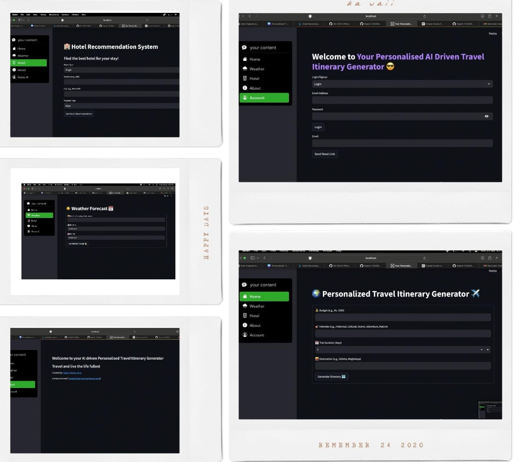

# Personalized AI-Driven Travel Itinerary Generator

## Overview
The **Personalized AI-Driven Travel Itinerary Generator** is a web application that provides travelers with personalized travel itineraries based on user preferences. By leveraging machine learning and generative AI technologies, the application generates tailored travel plans, including weather conditions and hotel recommendations.



## Problem Statement
Travelers often face challenges when planning their trips, such as:
- Lack of personalized recommendations.
- Difficulty in finding relevant information about places to visit.
- Time-consuming itinerary creation processes.

## Solution Approach
This application addresses these challenges by:
- Taking user inputs (budget, interests, trip duration, and destination) to generate a personalized travel plan.
- Providing weather forecasts for the destination, broken down by day during the trip.
- Recommending hotels based on user preferences, including room type and location.

- ## Dataset link for Hotel Recomendation - https://www.kaggle.com/datasets/keshavramaiah/hotel-recommendation

## Files in the Project
- **home.py**: Main application file for generating travel itineraries.
- **weather.py**: Handles weather-related functionalities and API integration.
- **hotel.py**: Manages hotel recommendations based on user preferences.
- **requirements.txt**: List of required Python packages for the project.
- **recommendation_model.pkl**: Trained machine learning model for hotel recommendations.
- **.env**: Contains environment variables for API keys (not included in the repo for security reasons).


## Technology Stack
- **Streamlit:** For building the web application.
- **Python:** The primary programming language used.
- **APIs:** 
  - Google Gemini for generative AI capabilities.
  - OpenWeather API for weather data.
- **Git:** For version control and collaboration.
- **Generative AI:** For creating travel plans and tips.
- **Machine Learning:** 
  - Scikit-learn for building the hotel recommendation model.
  - Data cleaning and exploratory data analysis (EDA) techniques using NumPy and Pandas.
- **Firebase:** For user authentication.

## Features
- Personalized travel itinerary generation based on user preferences (budget, interests, trip duration).
- Duration-wise weather conditions for the specified travel dates.
- Hotel recommendations tailored to user-defined criteria, such as room type and property type.

## Uniqueness
This application stands out due to its focus on personalization and integration of multiple data sources, providing users with a comprehensive travel planning experience. The use of advanced AI technologies enhances user experience and efficiency.

## Getting Started
### Prerequisites
- Python 3.x
- Streamlit
- Required packages from `requirements.txt`

### Installation
1. Clone the repository:
   ```bash
   git clone https://github.com/Rajesh-1234567/My-TPTI-Generator.git
   ```
2. Navigate to the project directory:
   ```bash
   cd My-TPTI-Generator
   ```
3. Create and activate a virtual environment:
   ```bash
   python -m venv venv
   source venv/bin/activate  # For macOS/Linux
   venv\Scripts\activate     # For Windows
   ```
4. Install the required packages:
   ```bash
   pip install -r requirements.txt
   ```

### Running the Application
To run the application, execute the following command:
```bash
streamlit run main.py
```

## Future Enhancements
- User review and feedback integration.
- Community features for travelers to share experiences.
- Real-time updates for weather and hotel availability.
- Expansion to include more destinations and personalized recommendations.

## License
This project is licensed under the MIT License. See the LICENSE file for details.

## Acknowledgments
- [Google Gemini](https://cloud.google.com/generative-ai) for AI capabilities.
- [OpenWeather API](https://openweathermap.org/api) for weather data.
- [Streamlit](https://streamlit.io/) for easy web app development.
- [Firebase](https://firebase.google.com/) for authentication.

## Contact
For inquiries or feedback, please contact:
- Rajesh Kumar Jena
- Email: rajeshkumarjena400@gmail.com
